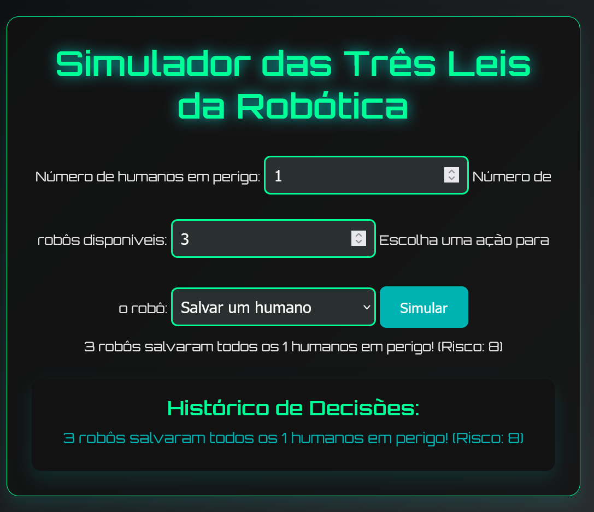

# Simulador das Três Leis da Robótica

Este repositório contém um simulador baseado nas Três Leis da Robótica, criadas por Isaac Asimov, aplicadas ao comportamento de robôs em um cenário com humanos e diversas ações. O objetivo do simulador é ilustrar como as decisões dos robôs podem ser tomadas de acordo com essas leis, considerando o número de humanos em perigo, o número de robôs disponíveis e as ações que os robôs podem executar.

## Funcionalidade do Site

O site possui uma interface simples onde o usuário pode inserir os seguintes parâmetros:

- **Número de humanos em perigo:** O número de humanos que precisam de ajuda.
- **Número de robôs disponíveis:** O número de robôs disponíveis para realizar ações.
- **Escolha de ação para o robô:** O usuário pode escolher uma ação que o robô pode realizar, como salvar um humano, ajudar em tarefas, analisar o ambiente ou interagir com humanos.

Com esses parâmetros, o sistema gera uma simulação que considera os riscos de falha dependendo da quantidade de robôs e humanos envolvidos.

### Como Funciona

1. O usuário define o número de humanos e robôs.
2. O usuário escolhe a ação que o robô realizará.
3. O sistema simula a ação escolhida, apresentando um resultado sobre o sucesso ou falha da tarefa, levando em conta o risco envolvido.
4. O histórico de decisões é mantido para cada simulação realizada.

## Imagens

*Acima está uma captura de tela do simulador em funcionamento.*

*Acima está a capa do livro "Eu, Robô", que introduz as Três Leis da Robótica de Isaac Asimov.*

## As Três Leis da Robótica

As **Três Leis da Robótica** foram criadas por Isaac Asimov e são uma base para a ética e a segurança no uso de robôs. O simulador baseia-se nessas leis para determinar as ações que os robôs podem executar.

### 1. Primeira Lei
Um robô não deve fazer mal a um ser humano, ou, por inação, permitir que um ser humano sofra dano.

Esta lei exige que os robôs priorizem a segurança humana. Em uma situação de perigo, a proteção dos seres humanos sempre deve ser a principal prioridade.

### 2. Segunda Lei
Um robô deve obedecer às ordens dadas por seres humanos, exceto quando tais ordens entrarem em conflito com a Primeira Lei.

Essa lei garante que os robôs sigam as instruções dos humanos, mas com uma limitação: se uma ordem colocar em risco a segurança humana, o robô deve desobedecer.

### 3. Terceira Lei
Um robô deve proteger a sua própria existência, desde que tal proteção não entre em conflito com as Primeira ou Segunda Leis.

A terceira lei determina que os robôs devem se proteger para continuar funcionando, mas isso não pode ocorrer à custa da segurança humana ou da obediência às ordens dos humanos.

## Contribuições

Este projeto é aberto a contribuições. Se você deseja sugerir melhorias, corrigir erros ou adicionar novos marcos históricos à linha do tempo, fique à vontade para abrir uma issue ou enviar um pull request. Sua contribuição é muito bem-vinda!

## Créditos

Desenvolvido por Mateus S.  
GitHub: [Matz-Turing](https://github.com/Matz-Turing)
